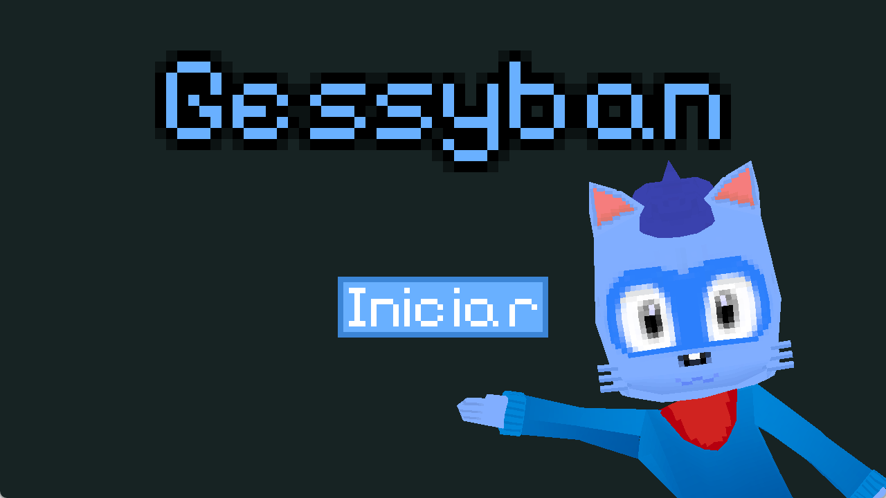
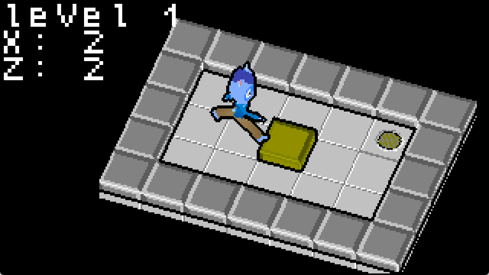
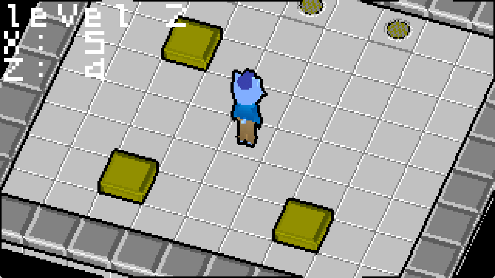
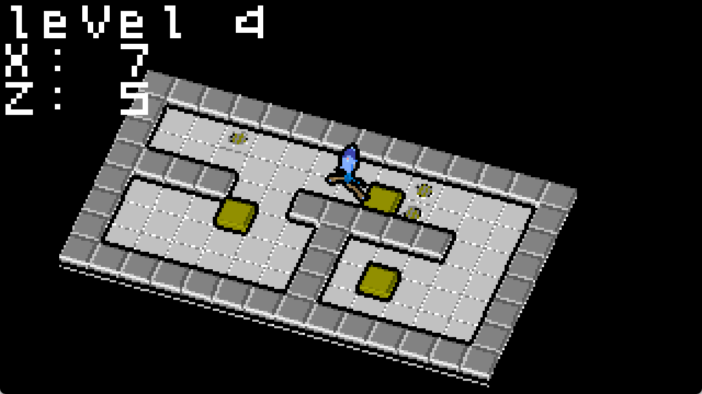
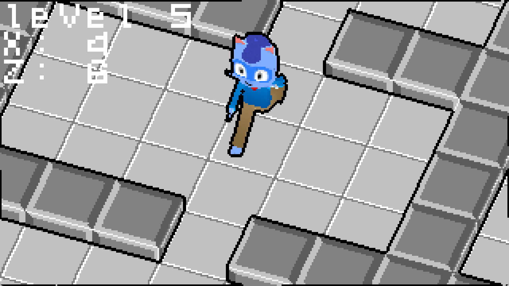

<h1 align="center">📦 Gessyban 📦</h1>

A 3D isometric Sokoban clone in LWJGL (OpenGL) and Kotlin!

It ain't the best clone out there, far from it, but it has a lot of bells and whistles that were *new* to me!

* A playable game! (woo)
* Skeletal Animations, even though the game only has three different static poses...
* Transition effects (they are a bit hacky however)
* Post-Processing effects with framebuffers
* Text Rendering (it is very bad however)
* A isometric camera that *gasp* follows the player!
* A custom mesh, armature/skeleton and pose formats (in JSON)
* Better shader management by exposing a `GameShader` class that allows you to set uniforms in a cleaner way
* And other cool tidbits... :3

**Gameplay Video:** https://youtu.be/rUnANuNMLlo

## Screenshots

